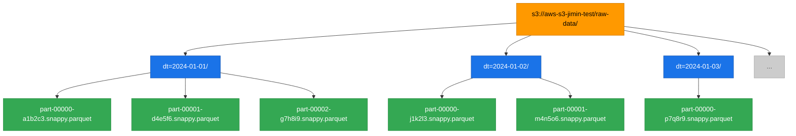

# S3 Parquet 저장 구조

Spark/Databricks는 파티션 컬럼(예: `dt`)을 기준으로 폴더를 자동 생성하고,
각 파티션 안에 병렬 처리한 태스크 수만큼 `part` 파일을 나눠서 저장한다.
**part 파일 1개 = Spark 태스크(파티션) 1개가 처리한 데이터 덩어리**

## 디렉토리 트리



## 각 레이어 설명

| 색상 | 레이어 | 설명 |
|------|--------|------|
| 주황 | S3 버킷 루트 | `S3_BASE_PATH` 에 해당하는 최상위 경로 |
| 파랑 | 파티션 폴더 | `partitionBy("dt")` 시 Spark이 자동 생성 |
| 초록 | part 파일 | Spark 병렬 태스크 수만큼 분할 저장 |

## part 파일 명명 규칙

```
part-{태스크번호}-{UUID}.{압축방식}.parquet
     00000        a1b2c3   snappy
```

- **태스크번호**: 0부터 시작, 클러스터 코어 수만큼 생성
- **UUID**: 파일 충돌 방지용 고유값
- **압축방식**: `snappy` (기본값, 속도 우선) / `gzip` (용량 우선)

## COPY INTO와의 관계

```python
# dt=2024-01-01/ 경로를 지정하면
# 그 안의 모든 part 파일을 자동으로 한 번에 읽어 Delta Table에 적재
COPY INTO my_table
FROM 's3://aws-s3-jimin-test/raw-data/dt=2024-01-01/'
FILEFORMAT = PARQUET
```

→ `etl_copy_into.py` 에서 파티션 경로 단위로 병렬화하는 이유가 바로 이 구조 때문
